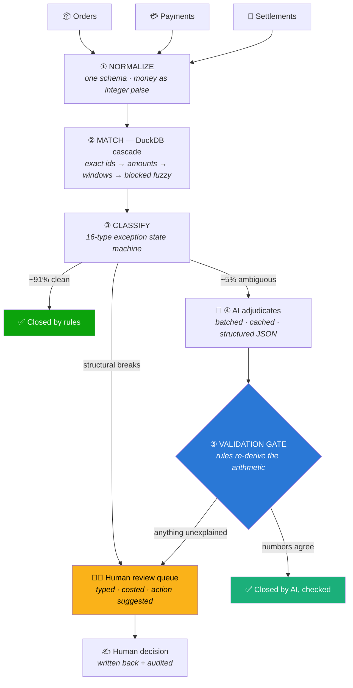

<div align="center">

# 💰 AI Finance Controller

### *Deterministic reconciliation at scale · AI for the exceptions · Humans for the judgment*

**Razorpay Hackathon — Track 04: Run the books and the cash position**

<br/>

[](https://finance-controller-web.onrender.com)
[](https://finance-controller-api-hq06.onrender.com/docs)

[](#-measured-results)
[](#-measured-results)
[](#-measured-results)
[](#-testing)
[](#-the-ai-is-on-a-leash-by-design)

<br/>

> **The system closes ~95% of the books with pure SQL, asks an AI about the ambiguous ~5%,**
> **re-checks the AI's arithmetic before trusting it — and hands the rest to a human, honestly.**

</div>

---

## 🚀 Try it right now

| | Link | Note |
|---|---|---|
| 🖥️ **Dashboard** | **https://finance-controller-web.onrender.com** | Pick *50 orders* → **Run reconciliation** |
| ⚡ **API (Swagger)** | **https://finance-controller-api-hq06.onrender.com/docs** | Every endpoint, interactive |
| ❤️ **Health** | https://finance-controller-api-hq06.onrender.com/api/health | Wakes the free instance (~30s cold start) |
| 🔍 **Engine config** | https://finance-controller-api-hq06.onrender.com/api/config | Live thresholds — nothing hidden |

> ⏱️ *Free-tier services sleep when idle — hit the health link first, then everything is instant.*

**60-second tour:** Run a 50-record batch → open the **Exceptions** queue (every unresolved case, typed & costed in plain language) → click **Inspect** on one → **Ask the AI to explain** → then ask the **Finance Chat** *"what's the settlement gap?"* → finish on **Benchmark** and re-run the accuracy sweep yourself.

---

## 🧠 The idea in one picture



**Why this shape?** Sending millions of rows to an LLM is slow, expensive, and unbenchmarkable — and it puts a probabilistic system in charge of a ledger. So we inverted it: **the model is the last resort, not the first.** That's also exactly what the track brief asks for — *"verification capacity, not generation speed, is the bottleneck."* This is a verification machine.

---

## 📊 Measured results

*Not vibes — scored against injected anomalies whose truth was recorded **before** the engine ever saw the data. Reproduce with `make bench`.*

| Orders | Records | Time | Throughput | Precision | Recall | Label accuracy | AI coverage |
|---:|---:|---:|---:|---:|---:|---:|---:|
| 1,000 | 2,998 | 0.10s | 30,867/s | **1.0000** | **1.0000** | 100.00% | 4.7% |
| 10,000 | 29,847 | 0.21s | 141,558/s | **1.0000** | **1.0000** | 100.00% | 5.0% |
| 100,000 | 298,301 | 1.49s | 200,604/s | **1.0000** | **1.0000** | 100.00% | 5.1% |
| **1,000,000** | **2,982,037** | **10.77s** | **276,858/s** | **1.0000** | **1.0000** | 99.9996% | 5.1% |

<details>
<summary><b>What do these columns actually mean?</b></summary>

- **"Positive" = the engine declared a case clean.** So a *false positive is a real break we wrongly closed* — the expensive error in finance. Precision measures exactly that.
- **Label accuracy** is stricter: the predicted exception *type* must match the injected one (a duplicate called a duplicate, not merely "flagged").
- **AI coverage** = share of cases the model had to see. Lower is better — the rules did the rest.
- Honest caveat: these are perfect scores **on a distribution we control**. On real garbled bank feeds, the ID-contradiction guard keeps false matches out of the closed set — they land in the human queue instead. See [Known limits](#-known-limits).
</details>

---

## 🎯 How this answers the Track 04 bar

> *"Throughput plus measured accuracy plus an honest exception list. One cherry-picked match proves nothing."*

| The bar | Our answer |
|---|---|
| **Throughput** | 276K records/s at 3M rows; live benchmark screen any judge can re-run |
| **Measured accuracy** | Precision/recall vs retained ground truth + a confusion matrix — not eyeballed |
| **Honest exception list** | Every unresolved case typed (11+ kinds), costed in ₹, with a suggested action and the *reason* it wasn't auto-closed |
| **Not cherry-picked** | A 50 → 1M sweep, regression-tested accuracy claims, and a public [known-limits](#-known-limits) list |

**The queue is the feature, not the apology.** Ops used to review *all* cases; now they review ~9% — each arriving with the arithmetic done and the AI's explanation attached. We didn't remove the human. We removed **91% of the human's work** and made the rest take seconds.

---

## 🤖 The AI is on a leash — by design

Six constraints, enforced in **code**, not in a prompt:

1. 🔍 **Sees only exceptions** — never the dataset, never a raw row
2. ✂️ **Sees only decision-relevant fields** — ~15 numbers, not records (cheaper, faster, less to hallucinate on)
3. 📐 **Structured JSON only** — schema-validated; a malformed verdict is a retry, not a corrupt ledger row
4. 🚧 **A deterministic gate re-derives the arithmetic** before any AI verdict closes a case — a confident *"it's just the gateway fee"* is **rejected** when ₹265 remains unexplained *(there's a test for exactly that)*
5. 🔒 **Unexplained money is never auto-closeable** — shortfalls, missing and orphan payments always reach a human, at any confidence
6. 📣 **Degradation is never silent** — no API key, refusal, timeout, dropped verdict, or blown budget all route to human review *with the reason recorded*

**Provider-agnostic:** runs on **Claude** or **Gemini** behind one interface — swap with a single env var (`AI_PROVIDER`), zero code changes. Cost control: batching (12 cases/request), prompt caching, fingerprint-cached verdicts, and a hard per-run budget that *reports* what it skipped.

<details>
<summary><b>🐛 Two bugs live testing caught (and why we publish them)</b></summary>

- **A 100× money hallucination.** Asked "how much is stuck?", the model turned ₹16,215.76 into *"₹16.22 lakh"*. Fix: the model never converts units anymore — every amount enters the prompt with a server-formatted display string it must quote verbatim.
- **A validation-gate hole.** A `MATCHED` verdict was checked on the payment side only. The gate now re-derives both sides. Found in a live verdict, closed same day, pinned by a regression test.

For a track whose thesis is *verification is the bottleneck*, catching your own AI's failures **is** the product.
</details>

---

## 🗂️ What the ops team sees

No jargon. Every exception speaks human:

| Instead of… | The queue says… | …and tells you what to do |
|---|---|---|
| `MISSING_SETTLEMENT` | **Money not deposited** | *"If it stays unsettled past the normal cycle, raise it with the gateway"* |
| `DUPLICATE` | **Charged twice** | *"Confirm the double charge and refund the extra payment"* |
| `FEE_VARIANCE` | **Fee higher than agreed** | *"The maths adds up but the rate does not — check the rate card"* |
| `ORPHAN_PAYMENT` | **Payment with no order** | *"Find which order this belongs to, or flag it for refund"* |

Cases are ordered by **money at risk**, and every decision (`Mark resolved` / `Escalate` / `Reject suggestion`) is recorded under the reviewer's name in an audit trail and written back into the books.

---

## ⚙️ Stack & structure

```
FastAPI + DuckDB + Polars ──── the engine     (SQL closes the books)
Claude / Gemini ────────────── the analyst    (structured verdicts, gated)
PostgreSQL / SQLite ────────── the memory     (runs, audit, decisions)
React + Vite + Recharts ────── the cockpit    (4 screens, light/dark)
Parquet (zstd) ─────────────── the format     (CSV is interchange, not storage)
```

```
backend/app/
├── engine/      rules.py (the cascade, declared as data) · matcher.py · classifier.py
├── ai/          client.py (both providers) · analyzer.py (the gate) · cache.py
├── data/        generator.py (ground-truth synthesis) · normalizer.py
├── bench/       metrics.py (precision/recall/F1) · harness.py
└── api/         one route module per screen
frontend/src/
├── lib/glossary.ts     every ops-facing word, one file
└── pages/              ControlTower · Exceptions · Chat · Benchmark
```

**Two performance stories worth telling** *(both found by measuring, not guessing)*:
- Materializing unmatched sets **before** the join: match stage **45.7s → 0.38s** on 300K records
- Native Polars serialization over per-row Python: normalize stage **~2× faster** → 1M rows end-to-end in **10.8s**

---

## 🏃 Run it locally

```bash
git clone https://github.com/ShubhamKrishna0/razorpay.git && cd razorpay
make install         # venv + deps + .env templates
make backend         # API      → http://localhost:8000/docs
make frontend        # dashboard → http://localhost:5173
```

**No API key? Everything still works** — exceptions route to the human queue and the UI says so. To enable the AI lane, add **one** of these to `backend/.env`:

```bash
GEMINI_API_KEY=...        # or ANTHROPIC_API_KEY=...   (AI_PROVIDER=auto picks it up)
```

**Headless (no browser):**
```bash
cd backend
.venv/bin/python -m app.cli demo --size 50 --ai        # full pipeline, one command
.venv/bin/python -m app.cli benchmark --sizes 1000,100000
.venv/bin/python -m app.cli export --run latest        # everything as CSV
```

**Deploy your own:** push to GitHub → Render → *New → Blueprint* → pick the repo. `render.yaml` + `scripts/` provision the API, dashboard and Postgres in one shot.

---

## 🧪 Testing

**68 tests**, six suites — including **18 adversarial cases** built to fool naive matchers *(near-duplicates, off-by-one-rupee noise, fee-vs-shortfall, same-ids-wrong-merchant, pairs that must NOT match)*, the **AI safety gate** (confident-but-wrong verdicts must be rejected), provider routing, and the accuracy claim itself — asserted in CI so a regression **fails the build, not the demo**.

```bash
cd backend && make test
```

---

## ⚠️ Known limits

*Stated plainly, because a system that hides its failure modes shouldn't be trusted with a ledger.*

- **Perfect scores are on our synthetic distribution.** Real garbled feeds retain tail risk — the ID-contradiction guard routes those to humans rather than closing them.
- **Single process** — DuckDB is embedded. Merchant partitions are independent, so horizontal sharding is the natural next step (not built).
- **One global fee rate** — per-merchant fee schedules are a lookup-table change, not a redesign.
- **Multi-currency detected, not converted** · **Chat is read-only over aggregates, by design.**
- **Free-tier hosting sleeps & wipes run artifacts on redeploy** — datasets regenerate in seconds; run fresh at demo time.

---

<div align="center">

## 👤 Built by

### **Shubham Krishna**

📧 [krishnashubham09@gmail.com](mailto:krishnashubham09@gmail.com) · 📱 [+91 91422 18275](tel:+919142218275) · 🐙 [@ShubhamKrishna0](https://github.com/ShubhamKrishna0)

<br/>

*"Don't build an AI that reconciles everything.*
*Build an engine that verifies millions of transactions — and tells you exactly where human judgment is still required."*

</div>
